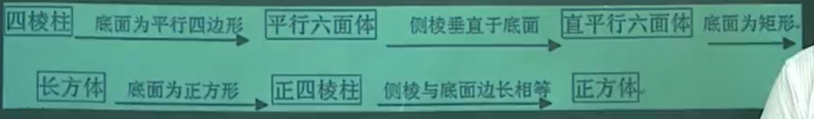
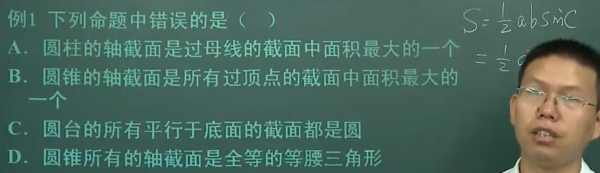
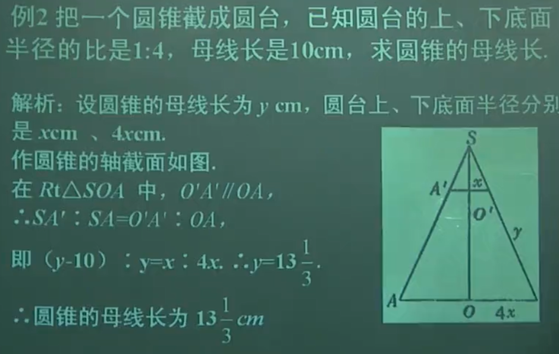

# 什么是几何

几何是多少，是量。
几何学，研究的是空间的多少。

点，线都是没有体积的空间，不要和颜色物体等概念混淆。

## 什么是物体

占据空间的物。
空间是个大背景
什么是物，当成一的项。

<!-- 什么是研究 -->
<!-- 学习 -->
<!-- 思考 -->
<!-- 为了知道 -->
<!-- 为了说明 -->
<!-- 为了解释 -->
空间都有什么。点，线，面，体。
点，线，面，体，是什么。
空是什么，间是什么。

空间几何体，是空间，有一定量，是体。
这个空间几何体的叫法，就很别扭，空间，一定量，的体。

我们观察到的任何存在都是现象，都是有限的。
空间是现象的一种。

知识是分层建立的，或者叫分步建立的，把不同步的概念混合在一起，隐藏了他们之间的关联，不知道的人想不到背后的关联，就得孤立地认识这个概念。

## 如何确定线围成的面是哪个

如何确定多面围成的体是哪个。

旋转体，
什么叫面运动留下的轨迹。

面运动的许多小体形成了一个大体。
线在小面中运动，若干个小面形成了一个大面。

棱
柱锥台
球

棱柱，两个面平行，其余面是四边形（平行四边形），且四边形的公共边互相平行。

直棱柱 斜楞柱 侧楞是否垂直地面
三棱四棱五棱

棱锥，一个面是多边形，其余面是三角形，且三角形有一个公共顶点。
谁为底？

正棱锥，底面是正多边形，侧面是等腰三角形。或者说，顶点在底面的投影是底面的中心。

正四棱锥的八分之一，四个面都是直角三角形。

截取棱锥得到棱台。四棱延长相交于一点。

正棱台，侧面是全等的等腰梯形，底面是正多边形。

圆柱，母线绕轴。
圆锥，直角三角形的一条边为旋转轴，其余两边选择。轴截面是等腰三角形。
半圆，以半圆的直径所在直线为旋转轴，半圆面绕轴旋转一周得到球。

不同空间体的三视图。

符号语言描述某个量。不要用直觉。形成符号语言纠正错误直觉后，然后用直觉。
能说出面积体积计算方法。
斜二测画法的作用。
考虑各种小知识点的作用。
计算表面积就是计算各面面积。

要能像老师一样讲述原理。

向量是什么，什么是方向?从哪个维度数这个量？把向量当成一个量
平均值只能用于同类量。
模用于不同类量。
所谓的维度就是从哪个方式数这个量。
向量加法，就是同类相加。
所谓的三角形法则，平行四边形法则，数二维空间量。

lamda乘以向量，就是向量的放大缩小，矩阵乘向量就是某一维度的放大缩小。
所以AB是对B的放大缩小。
使用矩阵说明对某一维的量变化，要说明对其他维的量的影响。
不像自然语言那么直接。

平行向量
共面向量
共线向量
线性相关
线性无关
线性组合
线性方程组
线性变换
线性空间
线性代数
线性规划
线性回归
线性插值
线性拟合
线性模型
线性代数

线面平行
线面垂直
线面相交
面面平行
面面垂直
面面相交

每个概念里的充要条件， 