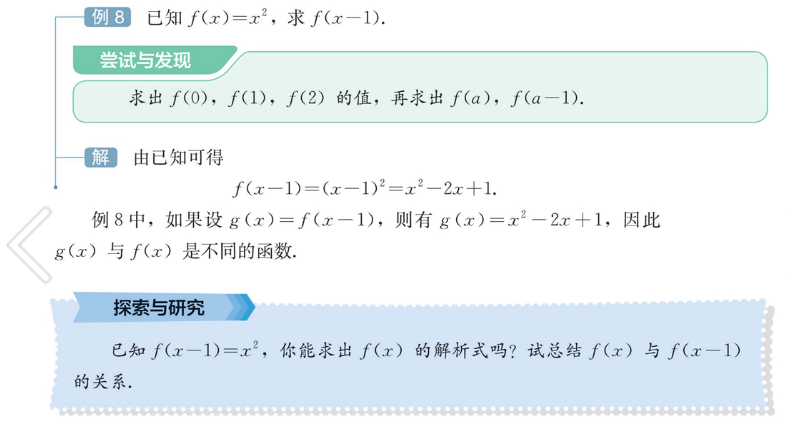
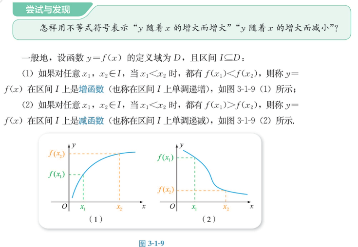
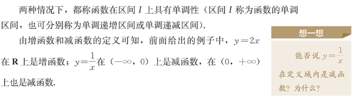

# 表达式

符号集合。符号有关系。结合关系，优先级关系。
运算符，被操作数字。分别对应运算和运算对象。
表达式表示了一个运算系统，包括输入，输出，中间转换过程。
若干表达式可以组合形成新的表达式。

## 函数

用表达式表示函数又称解析法。
函数还可以用列表法表示。
函数还可以用图表示。不过只是把数量看成了坐标从而映射出来的若干维图像。这叫图像法。
无法画出无数点实际使用描点作图法。

函数是被当成一个整体的表达式。围绕自身性质。

六种基本函数。`+`，`-`，`*`，`/`，`^`，`%`。这些函数可以组合成新的函数。

其他函数，取整函数，单值函数，常数函数，符号函数，绝对值函数，符号函数，阶乘函数，幂函数，指数函数，对数函数，三角函数，双曲函数，反三角，狄利克雷函数。
函数的位移，函数的还原，模板思维。

有各种形式的基本表达式，对应基本对运算系统。
线还是还是什么。，具体函数对应具体的线。所以要分情况讨论。
要研究通用的性质。通用函数。一元多次函数。多元一次函数。多元多次函数。
定义域值域周期对称单调性极值零点。导数渐近线微积分。
奇偶性，x^2n是偶函数，x^2n-1是奇函数。
换元

如何确定定义域，如何确定值域？
如何确定元素是否在定义域中。
如何确定函数是否有零点，如何确定零点的个数。
如何确定函数是否有极值，如何确定极值的个数。
如何确定函数是否有渐近线，如何确定渐近线的方程。
如何确定函数是否有周期，如何确定周期的大小。
如何确定函数是否有奇偶性，如何确定奇偶性的类型。
如何确定函数是否有对称轴，如何确定对称轴的方程。
如何确定函数是否单调，如何确定单调区间。
如何确定函数是否有导数，如何确定导数的表达式。
如何确定函数是否有积分，如何确定积分的表达式。
如何确定数对应的函数值？

## 等式和不等式

两个表达式以及他们之间的比较关系。围绕关系。

表达式的变形？
协变性
基本运算各种律

比较输入和输出是否相等。而不比较输入和过程是否一样。

量的关系，数的关系，量的拆分。数论。